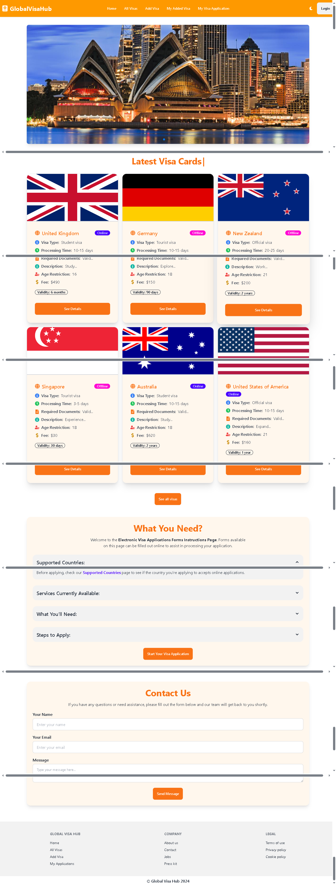

<!--1. project banner image -->
## 🌟 GlobalVisaHub 🚀


<!--2. project overview -->

A user-friendly Global Visa Hub platform that simplifies the process of exploring, applying, and managing visa applications.

---

<!--3. live project links and other relevant resources -->

## 🌐 Live Demo
[Visit the Website](https://assignment-10-global-visa-hub-akash.netlify.app/)

---

<!--4. main technologies used list -->

## ‍💻 Technologies Used

- **Frontend**: React.js, Tailwind CSS, DaisyUI
- **Backend**: Node.js, Express.js
- **Database**: MongoDB
- **Authentication**: Firebase Authentication
- **Styling Framework**: Tailwind CSS with DaisyUI components
- **Notifications**: SweetAlert2 for user-friendly alerts

---

<!--5. core features of the project -->

## ✨ Key Features

1. **Browse All Visas**: 
   - Explore visas from different countries with detailed information such as visa type, processing time, required documents, fees, and more.

2. **Add New Visas**: 
   - Users can add new visas with specific details like country name, visa type, age restrictions, application method, etc.

3. **User-Specific Visas**:
   - Added visas are displayed both in the "All Visas" section and a dedicated "My Added Visas" section for easy management.

4. **Filter Visas by Type**:
   - Easily filter visas based on categories like "Tourist Visa," "Student Visa," and "Official Visa."

5. **Real-Time Updates**:
   - Newly added visas are automatically updated on all relevant pages without needing a page refresh.

6. **Dynamic Details Page**:
   - Each visa includes a "See Details" option that provides a detailed view with specific information.

7. **Responsive Design**:
   - The platform is fully responsive, ensuring seamless usability across devices like mobile, tablet, and desktop.

8. **Admin Features**:
   - Admins can manage visa applications, including CRUD (Create, Read, Update, Delete) operations for visas.

---

<!--
6. mention the dependencies used list &
7. step by step guide on how to run the project locally
 -->

# 🚀 Full Stack Project Setup Guide  

This guide will help you set up and run both the **frontend** and **backend** of your project locally using **npm**.  

---  

## 📦 Dependencies  

### **Production Dependencies**  
The following packages are required for the application to function properly:  

- `@headlessui/react` - UI components for accessible interactions  
- `@stripe/react-stripe-js`, `@stripe/stripe-js` - Stripe integration for payments  
- `@tanstack/react-query` - Data fetching and caching  
- `axios` - HTTP client for API requests  
- `chart.js`, `react-chartjs-2` - Chart visualization  
- `date-fns` - Date manipulation  
- `firebase` - Firebase services (Auth, Firestore, etc.)  
- `localforage` - Client-side storage  
- `match-sorter` - Sorting and filtering utilities  
- `react`, `react-dom` - Core React library  
- `react-fast-marquee` - Marquee scrolling effect  
- `react-helmet-async` - SEO metadata management  
- `react-hot-toast` - Notifications and toast messages  
- `react-icons` - Icon library  
- `react-responsive-carousel` - Carousel component  
- `react-router-dom` - Routing  
- `react-slick`, `slick-carousel` - Carousel UI  
- `sort-by` - Sorting utilities  
- `sweetalert2` - Alert and modal popups  
- `swiper` - Swiping functionality  

### **Development Dependencies**  
These packages assist in development but are not included in production builds:  

- `@eslint/js`, `eslint`, `eslint-plugin-react`, `eslint-plugin-react-hooks`, `eslint-plugin-react-refresh` - Linting and code quality  
- `@types/react`, `@types/react-dom` - TypeScript support for React  
- `@vitejs/plugin-react` - React plugin for Vite  
- `autoprefixer`, `postcss`, `tailwindcss`, `daisyui` - CSS utilities and framework  
- `vite` - Build tool and development server  
- `globals` - Shared global variables  

---

## ⚙️ **Setting Up the Project Locally**  

Follow these steps to set up and run the project on your local machine using **npm**.

### **1️⃣ Prerequisites**  
Ensure you have the following installed:  
- **Node.js** (Latest LTS version recommended) - [Download Here](https://nodejs.org/)  
- **npm** (Comes with Node.js)  
- **Git** (Optional, for cloning the repository)  

### **2️⃣ Clone the Repository**  
If you haven't cloned the project yet, run:  
```sh
git clone https://github.com/abdulmazidakash/c-assignment-10-visa-navigating-client.git
cd c-assignment-10-visa-navigating-client
```

### **3️⃣ Install Dependencies**  
Run the following command to install all required packages:  
```sh
npm install
```

### **4️⃣ Configure Environment Variables**  
Create a `.env` file in the root directory and add the necessary environment variables. Example:  
```
REACT_APP_API_KEY=your_api_key_here
REACT_APP_FIREBASE_CONFIG=your_firebase_config_here
```
📌 *Ensure you get the correct values from your Firebase, Stripe, or API providers.*  

### **5️⃣ Start the Development Server**  
Run the following command to start the local development server:  
```sh
npm run dev
```
This will start the **Vite development server**, and you should see the project running at:  
```
http://localhost:5173
```

### **6️⃣ Build for Production (Optional)**  
To create an optimized production build, run:  
```sh
npm run build
```

### **7️⃣ Run the Production Build Locally (Optional)**  
To preview the production build locally:  
```sh
npm run preview
```

---

## 🎯 **You're All Set!**  
Now you can start developing and testing the project locally. 🚀 

# 🌍 Global Visa Hub




